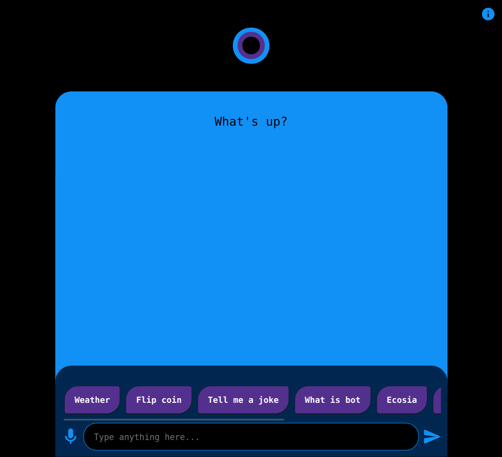
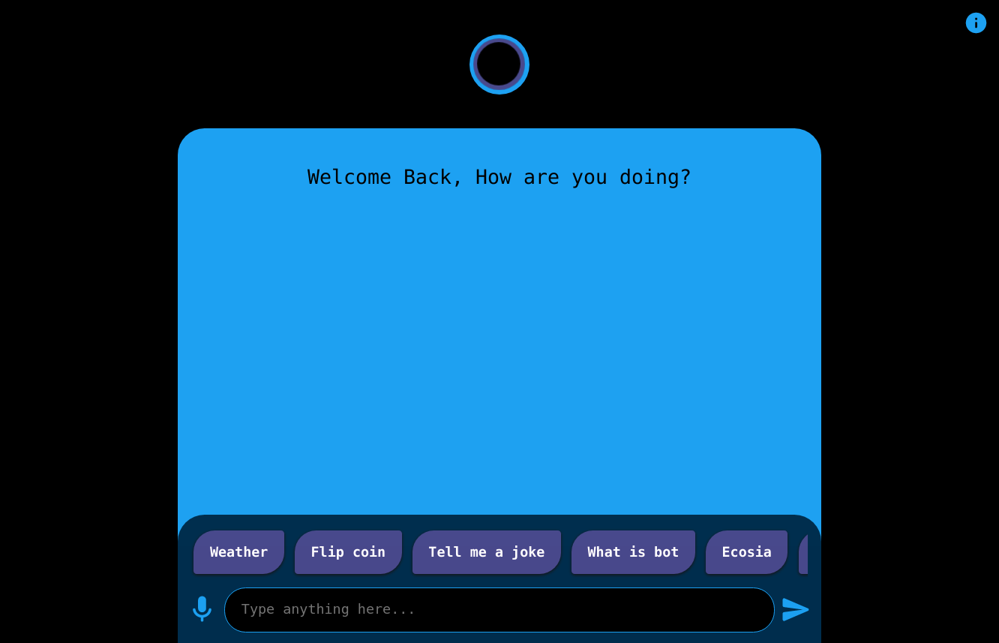

# haloBot - A bot with a halo

A simple internet bot written in vanilla javascript that can do nothing!

### [**Deployed on Github Pages**](https://r0manr0k0n.github.io/haloBot)

## Screenshots

## Known Issues/Bug

- Layout can break on tiny devices

## To-do

- Bug fix
- Change logo to match the latest halo

## Contributing

Any kind of contributions are welcome.

## License

### [**MIT**](./LICENSE)
